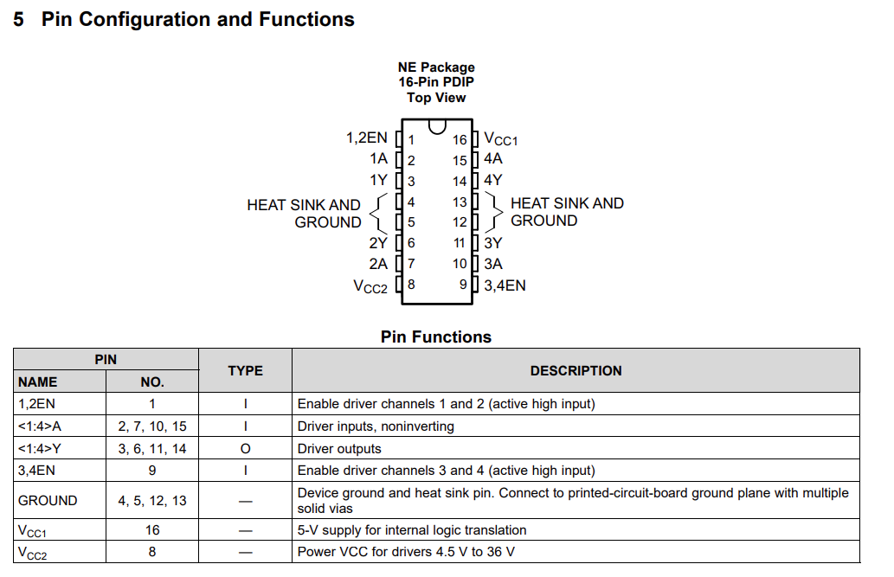
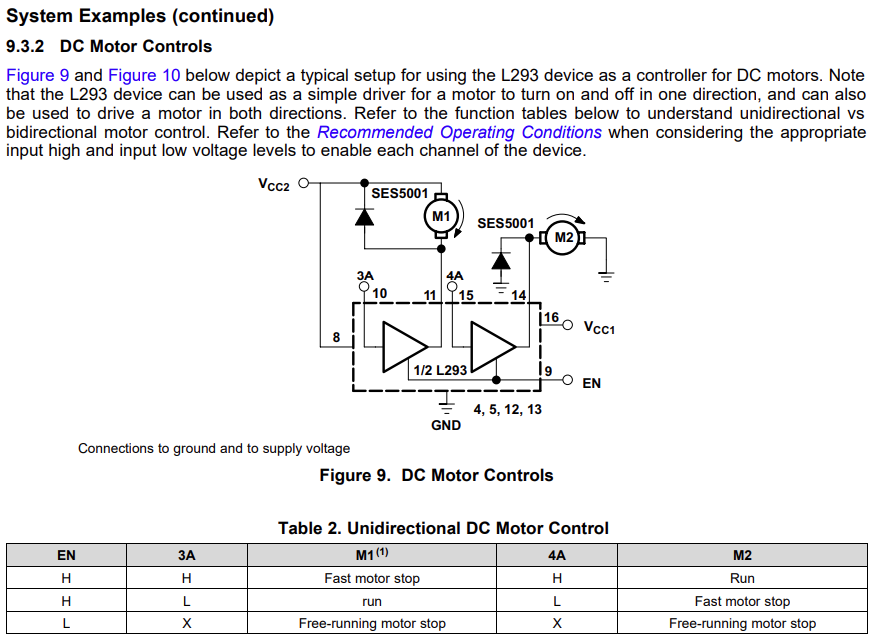

# Controlador de Temperatura com STM32H563zi
Trabalho final da disciplina de Arquitetura e Programação de Microcontroladores

> Alunos: Matheus Sebastiani Silva - 198204 & Gustavo Luiz Rosset - 198100

 Documentação de referência para este README: [Especificação do Projeto](docs/ECP171___Projeto_Final.pdf).

## Objetivo do trabalho

### Objetivo geral
Projetar um **sistema de controle de temperatura** capaz de aumentar e reduzir a temperatura de um ambiente com base na:

- **Temperatura medida**;
- **Valor programado pelo usuário _(set-point)_**.

### Visão Geral da Arquitetura do Sistema
O sistema implementa um controle de temperatura baseado em um laço proporcional (P), operando em conjunto com:

- Leitura analógica via ADC do sensor LM35
- Interface gráfica no display Nextion NX8048P070
- Acionamento PWM dos atuadores por meio do driver L293D
- Máquina de estados responsável pelos modos Automático, Manual e Segurança
- Camada de abstração para comunicação via UART entre STM32 <-> Nextion

### Processo de Compilação e Execução (Build Instructions)

Como compilar o projeto:

1. Abrir STM32CubeIDE
2. Importar o projeto em: File -> Import -> Existing STM32CubeIDE Project
3. Selecionar placa NUCLEO-H563ZI
4. Compilar -> Build Project
5. Conectar USB ST-Link
6. Flash no microcontrolador (Run -> Debug)

### Hardware Utilizado:

- Microcontrolador [_STM32H56ZI_](https://www.st.com/en/microcontrollers-microprocessors/stm32h563zi.html) utilizando o kit de desenvolvimento [NUCLEO-H563ZI](https://www.st.com/en/evaluation-tools/nucleo-h563zi.html);
    - Periféricos do Microcontrolador a serem utilizados:
    
    - **ADC** (_Analog-to-digital converter_) para a leitura de um sensor de temperatura LM35;
    
    - **PWM** utilizando os timers internos do microcontrolador para controlar proporcionalmente o aquecedor e o ventilador;

    - **GPIOs** para acender e apagar LEDs pré definidos.

### Requisitos de Firmware:

- O "firmware" deverá ser modular, implementado na Linguagem C utilizando a _HAL_ (_Hardware Abstraction Layer_) do Microcontrolador e utilizando a STM32CubeIDE, separados em vários arquivos `.h` e `.c`.
- O firmware deverá possuir uma **Máquina de Estados** para organizar os modos de operação do hardware. Os estados deverão ser:
    - Automático;
    - Manual;
    - Segurança.

---

## Interface Homem Máquina (IHM)

A interface entre Humano-Microcontrolador deverá obrigatoriamente utilizar um display **Nextion NX8048P070 (7”)**. O projeto de interface deverá ser desenvolvido do zero pelo aluno.

### Requisitos mínimos da IHM

O display deverá apresentar no mínimo as seguintes informações:

- **Temperatura atual** - (**_PV_** - _Process Value_);
- **Temperatura desejada** - (**_SP_** - _Set Point_);
- Estado atual das saídas:
    - Aquecedor (**ON/OFF**);
    - Ventilador (**ON/OFF**);
    - Driver geral: **Habilitado/Desabilitado**.

Através do IHM, deverá ser possível:
- Ajustar um novo **set-point** de temperatura;
- Ajustar o **ganho proporcional** do controlador (**Kp**);
- Habilitar/Desabilitar o controlador, desligando ou ligando o controlador independentemente do valor de temperatura;
- Ligar/Desligar manualmente o aquecedor;
- Ajustar o valor da saída do aquecedor no modo manual (**0-100%**);
- Ligar/Desligar manualmente o ventilador;
- Ajustar o valor da saída do ventilador no modo manual (**0-100%**);

A comunicação entre o microcontrolador e o display da Nextion deverá ser feita via UART, utilizando o protocolo de comandos do NEXTION.

> [!NOTE]
> O Display da NEXTION possui um protocolo próprio para a alteração de textos, variáveis e envio de leituras para o microcontrolador via serial. Porém nós estipulamos um novo protocólo próprio de melhor entendimento do processo. EXEMPLO: (**printh 10**; **print SP.val**; **printh FF**; **printh FF**; **printh FF**) isso para o valor do SP.

### Telas da IHM
O projeto deve apresentar, no mÍnimo, duas telas principais na IHM Nextion NX8048P070: uma tela para monitoração e ajustes automáticos e outra tela para comandos manuais.

## TELA 1 (MONITORAMENTO E AJUSTES):
Será a tela principal do projeto, onde estarão concentradas as informações referentes, contendo no mínimo:

1. SP (SET-POINT): Valor da temperatura a ser atingida, dependendo da escolha do usuário. 
2. PV (PROCESS VALUE): Valor atual da temperatura que será medido pelo sensor (LM35).
3. HEAT: Estado do aquecedor (RESISTOR), se estará ligado ou desligado.
4. FAN: Estado do ventilador, se estará ligado ou desligado.
5. DRIVER: Estado do driver de saída, se está habilitado (ON) ou desabilitado (OFF).
6. KP: Valor do ganho proporcional do controlador.

Nessa primeira tela, o usuário deve ser capaz de interagir com os elementos acima da seguinte forma...

1. Ajustar o valor do SET-POINT (temperatura desejada a ser atingida), utilizando-se de um SLIDER (escolha pessoal da dupla) para controlar o valor de SP.
2. Habilitar ou desabilitar o driver de saída (por meio de GPIO em nosso caso), quando habilitado o HEART-BEAT deve estar "pulsando" e "liberar" as saídas para o aquecedor e ventilador. Quando desabilitado, o led de HEART-BEAT deve se manter ACESSO CONTINUAMENTE e as saídas aos perífericos forçadas a 0 (ZERO) até sua habilitação ocorrer.

>[!NOTE]
>O HEART BEAT é um LED que informa o estado da execução do sistema, quando a execução for habilitada ele "pulsa" e quando desabilitada fica aceso continuamente.

## TELA 2 (MODO MANUAL - AQUECEDOR E VENTILADOR):
Será a tela em que o usuário poderá controlar manualmente a rotação do FAN (ventilador) e a temperatura do AQUECEDOR (resistor) independentemente da parte "automática" na tela 1, deverá conter no mínimo:
1. COMANDOS MANUAIS (AQUECEDOR): Botão de liga/desliga, ajuste de valor por porcentagem.
>[!NOTE]
>Quando ligado (ON), deve-se exibir claramente o percentual do valor, já quando desligado, a porcentagem não deve ser informada ou = 0%.
2. COMANDOS MANUAIS (VENTILADOR): Botão de liga/desliga, ajuste do valor por porcentagem.
>[!NOTE]
>Quando ligado (ON), deve-se exibir claramente o percentual do valor, já quando desligado, a porcentagem não deve ser informada ou = 0%.

>[!IMPORTANT]
>É importante salientar de que as telas estão de fácil entendimento e manuseio, além de fácil distinção entre uma e outra (TELA 1 & TELA 2).

### MICROCONTROLADOR E PERIFÉRICOS

## MCU - STM32H565ZI:
O microcontrolador será responsável por...
1. Leitura do sinal analógico vindo do sensor de temperatura (LM35) pelo ADC interno da placa.
2. Converter o valor ADC para graus Celsius.
3. Calcular o "erro" entre o SET-POINT e o PROCESS VALUE.
4. Aplicar o ganho proporcional Kp.
5. Gerar sinais PWM para comunicação com o FAN  e RESISTOR.
6. Comunicar via UART com o NEXTION NX8048P070 pela tela do computador para testes e ao fim do projeto com o display.
7. Controlar o LED do HEART BEAT
Todo o desenvolvimento será feito por meio da IDE STM32CubeIDE utilizando a biblioteca HAL, organizando em arquivos .C e .H.

FOTO DO MICRO COM A PLACA E SEUS PERIFERICOS

## SENSOR DE TEMPERATURA (LM35):
Sensor analógico que será responsável por passar os valores de temperatura a serem utilizados no projeto.

<!-- Aqui será utilizado um trecho de código HTML para centralizar a imagem. O GitHub permite essa bruxaria -->

<p align="center">
 
</p>

## Driver de Potência L293D - Quadruple Half-H Drivers

O driver de potência **L293D** é um CI composto por quatro meias Pontes-H feito para o acionamento de cargas indutivas como motores, indutores, relés, etc. Seu _datasheet_ pode ser verificado [aqui](docs/l293d.pdf).

Este CI é o driver sugerido para efetuar o acionamento do motor e da carga resistiva. 

Para uma melhor compreensão do CI, algumas especificações do _datasheet_ do componente serão detalhados aqui, por mais que, muito provavelmente, no momento da montagem e integração final dos componentes do trabalho, será fornecida uma placa com o circuito pronto para a conexão com as cargas + _PWM_ (através de um _shield_ muito provavelmente compatível com Arduino).

Algumas características elétricas do CI:
- Tensão de alimentação: 4.5 a 36V para _V<sub>cc1</sub>_ e _V<sub>cc2</sub>_
- Saídas de até 600mA por canal.

A pinagem do CI e a tabela contendo suas funções pode ser verificada em sequência:

<p align="center">
 
</p>

>[!NOTE]
>Ainda segundo o _datasheet_, é recomendado que  _V<sub>cc1</sub>_ opere de 4.5 a 7V, e que _V<sub>cc1</sub>_ opere de no mínimo _V<sub>cc1</sub>_ até 36V.

O driver pode ser utilizado de diversas maneiras. Como nossa aplicação acionará duas cargas, no caso, um Motor DC e uma carga resistiva, o driver será utilizado como se estivesse controlando dois Motores DC, como descreve a seção 9.3.2 do _datasheet_ do componente.

O modo de operação pode ser verificado na figura em sequência.

<p align="center">
 
</p>

Basicamente serão utilizados os pinos 10 (3A), 11 (3Y), 14 (4Y) e 15 (4A). Nos pinos identificados com Y, a corrente proveniente do acionamento das respectivas cargas fluirá. Os pinos terminados em A são os pinos de acionamento do respectivo transistor. No caso do 3A chaveando para o _GND_, e no caso do 4A, chaveando para _VCC_.

>[!NOTE]
>É necessário relembrar que os pinos de _enable_ do CI deverão ser acionados via _GPIOs_ do microcontrolador, caso o shield não ligue o pino internamente.

## AQUECEDOR:
Resistor (22 OHMS e 1/2 W) que irá fazer o papel do aquecedor no sistma (UTILIZAMOS UM LED PARA SIMULAR O FUNCIONAMENTO DO AQUECEDOR).

Para não ultrapassar a potência nominal que o resistor em questão suporta, realizamos um cálculo...

O resistor utilizado para aquecimento possui:
- Resistência: **R = 22 Ω**
- Potência nominal: **P = 0,5 W**

A relação entre potência, tensão e resistência é dada por:

**P = V² / R**

Mudando a fórmula, temos que a tensão máxima que pode ser aplicada sem ultrapassar a potência nominal é:

**Vmax = √(P · R)**

Substituindo os valores:

P · R = 0,5 × 22 = 11  
Vmax = √11 ≈ **3,32 V**

Portanto:

**Tensão máxima permitida: 3,32 V**  
**Corrente correspondente: I = 3,32 / 22 ≈ 0,1508 A**

### Configuração do PWM para o Resistor

O PWM para acionar o aquecedor foi configurado da seguinte maneira, buscando uma frequência de `fpwm = 20kHz`:

```c
#define PWM_RESISTOR_ARR 	 						2500-1
#define PWM_RESISTOR_PSC 	 						5-1
#define PWM_RESISTOR_CCR_MAX 						688

#define FATOR_CONVERSAO_DUTY_PWM_RESISTOR_NEXTION  0.275f
````

No caso, o registrador `ARR` foi configurado para receber o valor de 2499, o `PSC` para 4, e o valor máximo do registrador `CCR` para 688.

Como a tensão máxima do resistor pode chegar a apenas 3.3V, é necessário limitar o _Duty Cicle_ do PWM que controlará o driver L293D.

Como:

```
Vmédia = Vmáx * Duty Cicle
```
Temos:

```
3.3 = 12 * Duty Cicle Máximo
```

```
Duty Cicle Máximo = 0,275 ou 27,5%
```

Por conta disso, existe a definição da constante:

```c
#define FATOR_CONVERSAO_DUTY_PWM_RESISTOR_NEXTION  0.275f
```

Pois, para esse PWM, todo valor recebido pela função que o acionará, deverá ser multiplicado por essa constante para manter o valor máximo de tensão média igual a 3.3V.

## VENTILADOR:
Será reproduzido por um motor DC, tendo como especificações os seguintes valores... (UTILIZAMOS UM LED PARA SIMULAR O FUNCIONAMENTO DO FAN)
1. Tensão de alimentação: 12 VDC
2. Corrente típica: 130 mA

>[!IMPORTANT]
>O ventilador (MOTOR DC) deverá ser acionado pelo driver de potência já especificado, contendo a modulação PWM vindo do microcontrolador.

## LED DE HEART-BEAT:
Esse LED informa visualmente sem precisar do uso da GUI, como está o estado do sistema, se ele estiver PULSANDO o sistema está com o driver LIGADO, se estiver aceso de forma CONTÍNUA o sistema está com o driver desligado.

Para a implementação da lógica desse led no sistema foram feitos os seguintes cálculos para funciomaneto em um TIMER:

- Fled = 0,5 Hz
- T = 1/F -> T = 1/0,5 -> T = 2s
- t = (PSC + 1) · (ARR + 1) · 250 MHz 
- 2 = (PSC + 1) · (ARR + 1) · 4 ns
- (PSC + 1) · (ARR + 1) = 2/4 n
- (PSC + 1 ) · (ARR + 1) = 5 · 10⁸
- 10000 · (ARR + 1) = 5 · 10⁸
- 50000 = (ARR + 1)
- ARR = **49999**
>[!NOTE]
> PSC seria o PREESCALER e o ARR seria Auto Reload Register

## ACIONAMENTO DAS SAÍDAS:

Contendo agora todos os perifericos do projeto, podemos estipular uma logica para que o acionamento das saídas utilizadas sejam feitas corretamente (AQUECEDOR, VENTILADOR).
>[!IMPORTANT]
>É válido recordar de que temos 2 modos de operação, AUTOMÁTICO e MANUAL.

### MODO AUTOMÁTICO:
1. O controlador pessoal (P) que será responsável por determinar o valor de saída, tendo em vista a diferença de SP e PV -> e(t) = SP - PV.
>[!NOTE]
>O controlador proporcional  ́e definido por: u(t) = Kp · e(t)
> - Kp é o ganho proporcional;
> - e(t) é o erro entre referência e saída;
> - u(t) é o sinal aplicado ao atuador

2. REGRAS DE FUNCIONAMENTO DO AQUECEDOR:
   Ele deverá ser acionado sempre que o valor do setpoint (SP) for maior que o process value (PV) -> SP > PV.
   Na condiçao acima, e erro é positivo, o valor proporcional gerado pelo controlador é maior que 0, o PWM do aquecedor irá receber o valor após a saturação entre 0% e 100% e o ventilador deverá se manter ligado durante esse processo.
>[!NOTE]
> EXEMPLOS:
> - SP = 50◦C, P V = 42◦C, o valor de (e) será = 8◦C (DIANTE DISSO O AQUECEDOR DEVERÁ LIGAR COM POTÊNCIA PROPORCIONAL AO VALOR DO ERRO (e)
> - SP=40°C, PV=35°C -> **Aquecedor liga com Kp(5°C)**
> - SP=40°C, PV=40.2°C -> **Zona morta**
> - Driver OFF -> **Ambos desligados**

3. REGRAS DE FUNCIOMANTO DO VENTILADOR:
   Ele deve ser acionado sempre que o valor do process value (PV) for maior que o set point (SP) -> PV > SP.
   Na condição acima, o erro será negativo, a ação de aquecer não se torna necessária (PWM = 0), a intensidade do ventilador deve ser relacionada com o módulo do valor do erro (e) e o aquecedor deve se manter desligado.
>[!NOTE]
>EXEMPLOS:
> - SP = 40◦C, PV = 47◦C, o valor de (e) será  = −7◦C (DIANTE DISSO O SISTEMA DEVE LIGAR O VENTILADOR CONTENDO A POTÊNCIA EQUIVALENTE OU PROPORCIONAL AO ERRO (e))
> - SP=40°C, PV=47°C -> **Fan liga**
> - SP=40°C, PV=40.2°C -> **Zona morta**
> - Driver OFF -> **Ambos desligados**

4. ZONA MORTA:
   Foi observado que seria recomendado a implementação de uma "ZONA MORTA" pelo fato de que oscilações rápidas de temperatura pudessem ocorrer -> |SP - PV| < 0,5 ◦C
   Para essa condição basicamente o ventilador e aquecedor mantém-se desligados e o sistema fica no aguardo de uma nova verificação.

### MODO MANUAL:
Nesse modo o próprio usuário tem controle do sistema de aquecer e ventilar.
Na ocasião acima...
1. O controlador proporcional (KP) irá ser completamente ignorado.
2. Apenas a saída que estiver ligada (ON) recebe o valor que for ajustado.
3. Quando ambas as saídas estiverem ligadas (ON) os respectivos indicadores serão mostrados na interface de usuário (GUI).
4. Só é possível enviar os valores quando os botões referentes ao aquecedor e fan estiverem ligados.

>[!IMPORTANT]
> Quando o driver estiver completamente DESABILITADO, ambas as saídas devem estar com 0% (DESLIGADO) e o led de HEART BEAT deve se manter acesso continuamente (ESSE ESTADO POSSUI PRIORIDADE DENTRE TODOS OS OUTROS).

## DESENHO ESQUEMÁTICO:

---

## ETAPAS DE MONTAGEM DO CIRCUITO DO PROJETO:

### INICIO DA MONTAGEM: 
<p align="center">
 
</p>

>[!NOTE]
>Acima está o início do processo de montagem.

### ADIÇÃO DO SENSOR DE TEMPERATURA LM35:
<p align="center">
 
</p>

>[!NOTE]
>Acima está a montagem e ligação dos pinos do sensor de temperatura que passa o valor do PV (PROCESS VALUE).

### FIM DA MONTAGEM:
<p align="center">
 
</p>

>[!NOTE]
>Acima está a montagem e ligação dos 3 LEDs, referente a: FAN, AQUECEDOR E HEART-BEAT.

## Documentação - Comunicação NEXTION + STM32

O display da Nextion possui um protocolo definido de mensagens, e a possibilidade de programar mensagens quando determinados eventos acontecem, como por exemplo, quando um botão é pressionado. O Nextion possui um protocolo definido para a recepção de mensagens via serial, para então, responder o que o transmissor da mensagem deseja conhecer.

Na [documentação do Nextion](https://wiki.iteadstudio.com/Nextion_Instruction_Set#page:_Refresh_page), é possível encontrar o "cabeçalho" de suas mensagens. O cabeçalho seria basicamente o primeiro byte de uma série de bytes enviados pelo Nextion. Cada byte, possui um significado, e, consequentemente, uma formatação.

Mensagens de evento de toque, por exemplo, possuem mais bytes do que mensagens de páginas ativas. É possível customizar a forma com que o Nextion reporta determinados eventos ocorridos em sua execução, mas nem sempre isso é possível.

Por conta disso, é necessário que exista uma camada de abstração que simplifique isso e deixe o firmware mais limpo, funcional e escalável.

Essa abstração pode ser implementada com uma Máquina de Estados Finitos, sendo cada "tipo de evento" reportado pelo, ou solicitado para o Nextion, um estado, possibilitando uma maneira mais simples e organizada de tratar as mensagens vindas do Nextion.

Podemos mapear os principais eventos ocorridos entre o Nextion e o STM32 como:

- Esperando mensagem;
- Interpretando um evento de toque;
- Interpretando uma recepção de valor inteiro.

No caso, para evitar operações como:

```
Nextion envia um evento de toque de botão -> STM32 processa -> STM32 solicita um valor de um campo do display -> Nextion manda o valor -> STM32 processa.
```

Uma abordagem diferente foi pensada. Ao invés de ser feito o descrito acima, e para evitar várias interrupções seguidas da UART, o Nextion foi programado de maneira diferente para quando determinado botão for pressionado, por exemplo.

Por exemplo, quando o usuário selecionar, no modo automático, o valor de _Set Point_, após ele pressionar em confirmar, o Nextion reportará esse evento para o STM32. No caso, esse evento terá um identificador único no primeiro byte de mensagem, seguido do valor escrito de _Set Point_. Isso reduz a necessidade de solicitar e receber o valor do _Set Point_ do Nextion.

No caso, as possibilidades mapeadas foram:

## ENVIO DE DADOS DO NEXTION PARA O MCU...
Utilziamos de um protocolo novo que fizemos com base no protocolo padrao de envio de mensagnes do nextion, dessa forma nossa GUI segue o seguinte...
### BOTÕES:
 1. Confirmar envio do SP:
    ```c
    printh 10
    print SP.val
    printh FF
    printh FF
    printh FF
    ```
2. Ligar ou desligar o DRIVER:
   ```c
   printh 50
   print DRIVER_ONOFF.val
   printh FF
   printh FF
   printh FF
   ```
3. Ligar ou desligar o HEATER:
   ```c
   printh 55
   print H_ONOFF.val
   printh FF
   printh FF
   printh FF
   ```
4. Ligar ou desligar o FAN:
   ```c
   printh 56
   print F_ONOFF.val
   printh FF
   printh FF
   printh FF
   ```
5. Trocar página de AUTOMÁTICO para MANUAL:
   ```c
   printh F0
   printh 01
   printh FF
   printh FF
   printh FF
   page MANUAL
   ```
6. Trocar página de MANUAL para AUTOMÁTICO:
   ```c
   printh F1
   printh 00
   printh FF
   printh FF
   printh FF
   page AUTOMATICO
   ```
 ### SLIDERS:
1. Confirmar envio do HEATER (EM %):
   ```c
   printh 5
   print H_VALUE.val
   printh FF
   printh FF
   printh FF
   ```
2. Confirmar envio do FAN (EM %):
   ```c
   printh 4
   print F_VALUE.val
   printh FF
   printh FF
   printh FF
   ```
3. Confirmar envio do KP:
    ```c
    printh 20
    print KP.val
    printh FF
    printh FF
    printh FF
    ```
## RECEBIMENTO DE DADOS DO MCU PARA O NEXTION...
### VALOR NÚMERICO:
1. Para o PROCESS_VALUE (PV):
   ```c
   PV.val=<VALOR LIDO PELO MICRO> -> PV.val=255\xFF\xFF\xFF
   ```
### TEXTO:
1. Para o estado do FAN:
   ```c
   FAN_STATE.txt-"<TEXTO A PARTIR DO MICRO>" -> FAN_STATE.txt=\"ON\"\xFF\xFF\xFF
   ```
2. Para o estado do HEATER:
   ```c
   HEAT_STATE.txt="<TEXTO A PARTIR DO MICRO>" -> HEAT_STATE.txt=\"ON\"\xFF\xFF\xFF
   ```
3. Para o estado do DRIVER:
   ```c
   DRIVER_STATE.txt="<TEXTO A PARTIR DO MICRO>" -> DRIVER_STATE.txt=\"ON\"\xFF\xFF\xFF
   ```


