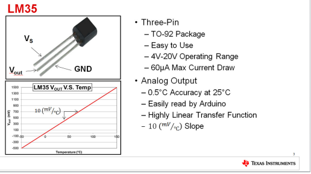

# Controlador de Temperatura com STM32H563zi
Trabalho final da disciplina de Arquitetura e Programação de Microcontroladores

> Alunos: Matheus Sebastiani Silva - 198204 & Gustavo Luiz Rosset - 198100

 Documentação de referência para este README: [Especificação do Projeto](docs/ECP171___Projeto_Final.pdf).

## Objetivo do trabalho

Projetar um **sistema de controle de temperatura** capaz de aumentar e reduzir a temperatura de um ambiente com base na:

- **Temperatura medida**;
- **Valor programado pelo usuário _(set-point)_**.

### Hardware Utilizado:

- Microcontrolador [_STM32H56ZI_](https://www.st.com/en/microcontrollers-microprocessors/stm32h563zi.html) utilizando o kit de desenvolvimento [NUCLEO-H563ZI](https://www.st.com/en/evaluation-tools/nucleo-h563zi.html);
    - Periféricos do Microcontrolador a serem utilizados:
    
    - **ADC** (_Analog-to-digital converter_) para a leitura de um sensor de temperatura LM35;
    
    - **PWM** utilizando os timers internos do microcontrolador para controlar proporcionalmente o aquecedor e o ventilador;

    - **GPIOs** para acender e apagar LEDs pré definidos.

### Requisitos de Firmware:

- O "firmware" deverá ser modular, implementado na Linguagem C utilizando a _HAL_ (_Hardware Abstraction Layer_) do Microcontrolador e utilizando a STM32CubeIDE, separados em vários arquivos `.h` e `.c`.
- O firmware deverá possuir uma **Máquina de Estados** para organizar os modos de operação do hardware. Os estados deverão ser:
    - Automático;
    - Manual;
    - Segurança.

---

## Interface Homem Máquina (IHM)

A interface entre Humano-Microcontrolador deverá obrigatoriamente utilizar um display **Nextion NX8048P070 (7”)**. O projeto de interface deverá ser desenvolvido do zero pelo aluno.

### Requisitos mínimos da IHM

O display deverá apresentar no mínimo as seguintes informações:

- **Temperatura atual** - (**_PV_** - _Process Value_);
- **Temperatura desejada** - (**_SP_** - _Set Point_);
- Estado atual das saídas:
    - Aquecedor (**ON/OFF**);
    - Ventilador (**ON/OFF**);
    - Driver geral: **Habilitado/Desabilitado**.

Através do IHM, deverá ser possível:
- Ajustar um novo **set-point** de temperatura;
- Ajustar o **ganho proporcional** do controlador (**Kp**);
- Habilitar/Desabilitar o controlador, desligando ou ligando o controlador independentemente do valor de temperatura;
- Ligar/Desligar manualmente o aquecedor;
- Ajustar o valor da saída do aquecedor no modo manual (**0-100%**);
- Ligar/Desligar manualmente o ventilador;
- Ajustar o valor da saída do ventilador no modo manual (**0-100%**);

A comunicação entre o microcontrolador e o display da Nextion deverá ser feita via UART, utilizando o protocolo de comandos do NEXTION.

> [!NOTE]
> O Display da NEXTION possui um protocolo próprio para a alteração de textos, variáveis e envio de leituras para o microcontrolador via serial.

### Telas da IHM
O projeto deve apresentar, no mÍnimo, duas telas principais na IHM Nextion NX8048P070: uma tela para monitoração e ajustes automáticos e outra tela para comandos manuais.

## TELA 1 (MONITORAMENTO E AJUSTES):
Será a tela principal do projeto, onde estarão concentradas as informações referentes, contendo no mínimo:

1. SP (SET-POINT): Valor da temperatura a ser atingida, dependendo da escolha do usuário. 
2. PV (PROCESS VALUE): Valor atual da temperatura que será medido pelo sensor (LM35).
3. HEAT: Estado do aquecedor (RESISTOR), se estará ligado ou desligado.
4. FAN: Estado do ventilador, se estará ligado ou desligado.
5. DRIVER: Estado do driver de saída, se esta habilitado (ON) ou desabilitado (OFF).
6. KP: Valor do ganho porporcional do controlador.

Nessa primeira tela, o usuário deve ser capaz de interagir com os elementos acima da seguinte forma...

1. Ajustar o valor do SET-POINT (temperatura desejada a ser atingida), utilizando-se de um SLIDER (escolha pessoal da dupla) para controlar o valor de SP.
2. Habilitar ou desabilitar o driver de saída (por meio de GPIO em nosso caso), quando habilitado o HEART-BEAT deve estar "pulsando" e "liberar" as saídas para o aquecedor e ventilador. Quando desabilitado, o led de HEART-BEAT deve se manter ACESSO CONTINUAMENTE e
   as saídas aos perífericos forçadas a 0 (ZERO) até sua habilitação ocorrer.
>[!NOTE]
>O HEART BEAT é um LED que informa o estado da execução do sistema, quando a execução for habilitada ele "pulsa" e quando desabilitada fica aceso continuamente.

## TELA 2 (MODO MANUAL - AQUECEDOR E VENTILADOR):
Será a tela em que o usuário poderá controlar manualmente a rotação do FAN (ventilador) e a temperatura do AQUECEDOR (resistor) independentemente da parte "automática" na tela 1, deverá conter no mínimo:
1. COMANDOS MANUAIS (AQUECEDOR): Botão de liga/desliga, ajuste de valor por porcentagem.
>[!NOTE]
>Quando ligado (ON), deve-se exibir claramente o percentual do valor, já quando desligado, a porcentagem não deve ser informada ou = 0%.
2. COMANDOS MANUAIS (VENTILADOR): Botão de liga/desliga, ajuste do valor por porcentagem.
>[!NOTE]
>Quando ligado (ON), deve-se exibir claramente o percentual do valor, já quando desligado, a porcentagem não deve ser informada ou = 0%.

>[!IMPORTANT]
>É importante salientar de que as telas deverão ser de fácil entendimento e manuseio, além de fácil distinção entre uma e outra (TELA 1 & TELA 2).

### PERIFÉRICOS E MICROCONTROLADOR

## MCU - STM32H565ZI:
O microcontrolador será responsável por...
1. Leitura do sinal analogico vindo do sensor de temperatura (LM35) pelo ADC interno da placa.
2. Converter o valor ADC para graus Celsius.
3. Calcular o "erro" entre o SET-POINT e o PROCESS VALUE.
4. Aplicar o ganho proporcional Kp.
5. Gerar sinais PWM para comunicação com o FAN  e RESISTOR.
6. Comunicar via UART com o NEXTION NX8048P070 pela tela do computador para testes e ao fim do projeto com o display.
7. Controlar o LED do HEART BEAT
Todo o desenvolvimento será feito por meio da IDE STM32CubeIDE utilziando a biblioteca HAL, organizando em arquivos .C e .H.

FOTO DO MICRO COM A PLACA E SEUS PERIFERICOS

## SENSOR DE TEMPERATURA (LM35):
Sensor analogico que sera responsável por passar os valores de temperatura a serem utilizados no projeto.

<!-- Aqui será utilizado um trecho de código HTML para centralizar a imagem. O GitHub permite essa bruxaria -->

 

